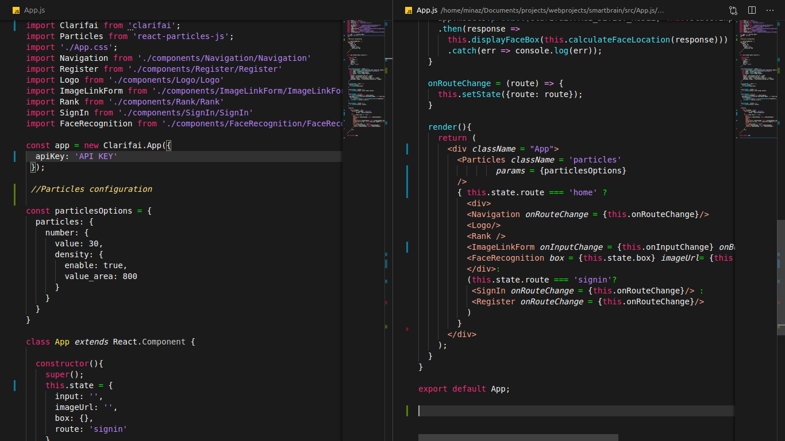
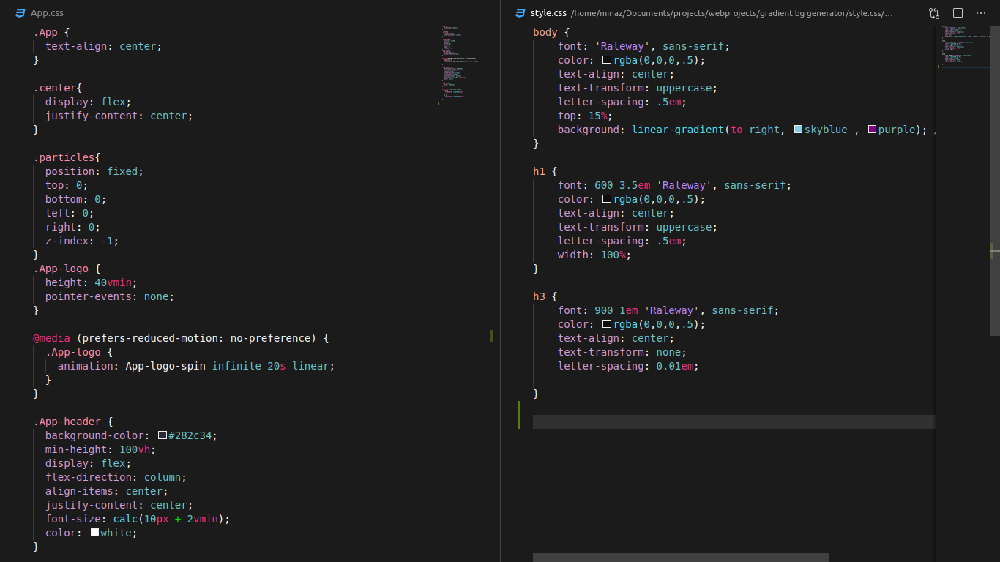
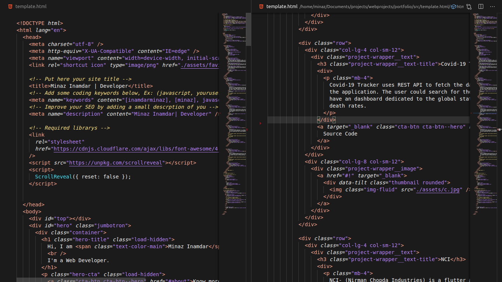

# NEKHBET Dark Theme

Nekhbet is a Visual Studio Code theme for coders who enjoy modern and vibrant color schemes.💜

Nekhbet is currently themed for Javascript, HTML and CSS. In the upcoming releases it will be themed for more languages.

### NEKHBET JAVASCRIPT

### NEKHBET CSS

### NEKHBET HTML

## Installation
1. Open **Extensions** sidebar panel in VS Code. `View → Extensions`
2. Search for `nekhbet`
3. Click **Install** to install it.
4. Click **Reload** to reload  your editor
5. Code > Preferences > Color Theme > **nekhbet**

## Contributing
Pull requests are welcome. For major changes, please open an issue first to discuss what you would like to change.Thankyou 💕

